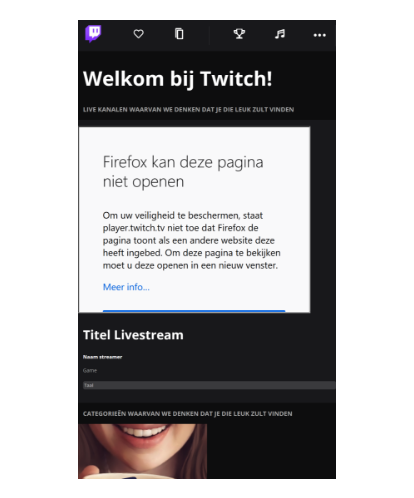

# Procesverslag
**Auteur:** Timo Smit

https://codepen.io/TurksePizza

Markdown cheat cheet: [Hulp bij het schrijven van Markdown](https://github.com/adam-p/markdown-here/wiki/Markdown-Cheatsheet). Nb. de standaardstructuur en de spartaanse opmaak zijn helemaal prima. Het gaat om de inhoud van je procesverslag. Besteedt de tijd voor pracht en praal aan je website.

## Bronnenlijst
1. -bron 1-
2. -bron 2-
3. -...-

## Eindgesprek (week 7/8)

-dit ging goed & dit was lastig-

**Screenshot(s):**

-screenshot(s) van je eindresultaat-

## Voortgang 3 (week 6)

-same as voortgang 1-

**Screenshot(s):**

## Voortgang 2 (week 5)

Mijn readme was nog niet helemaal up to date dus dat moet ik bijwerken.
Het antwoord op mijn gestelde vraag over de profiel foto is dat ik :not en :end of type moet gebruiken in het icon menu.

## Voortgang 1 (week 3)

### Stand van zaken

Ik vind het lastig de correcte elementen te gebruiken. Vooral aangezien we twee pagina's hebben en je een main op beide pagina's stijlt.
Ik ben niet erg bekend met elementen aangeven en die specificeren, bijvoorbeeld :nth of type of :not etc.

**Screenshot(s):**

### Agenda voor meeting

We hadden een uur voor de feedback meeting afgesproken met ons groepje om elkaars werk na te kijken.
De feedback die ik heb gekregen was minimaal en heb ik hieronder samengenomen in de feedback van de meeting.

### Verslag van meeting

Ik ben van website geswitched dus moet ik mijn breakdownschets opnieuw maken.
Na zelf een vraag gesteld te hebben over de tekst gebruik ik h1,h2 etc. verkeerd.
Het is handig als ik in mijn screenshots de mobiele versie van de website van Twitch toevoeg.
Ik heb overbodig div's gebruikt. Ik kan dit vervangen voor ul en li.
Ik moet nog een goed kijken naar de namen van mijn elementen, ik kan op sommige pleken better strong en article gebruiken.

## Intake (week 1)

**Je startniveau:** Rood

**Je focus:** Responsive

**Je opdracht:** https://www.twitch.tv/

**Screenshot(s):**

**Breakdown-schets(en):**

